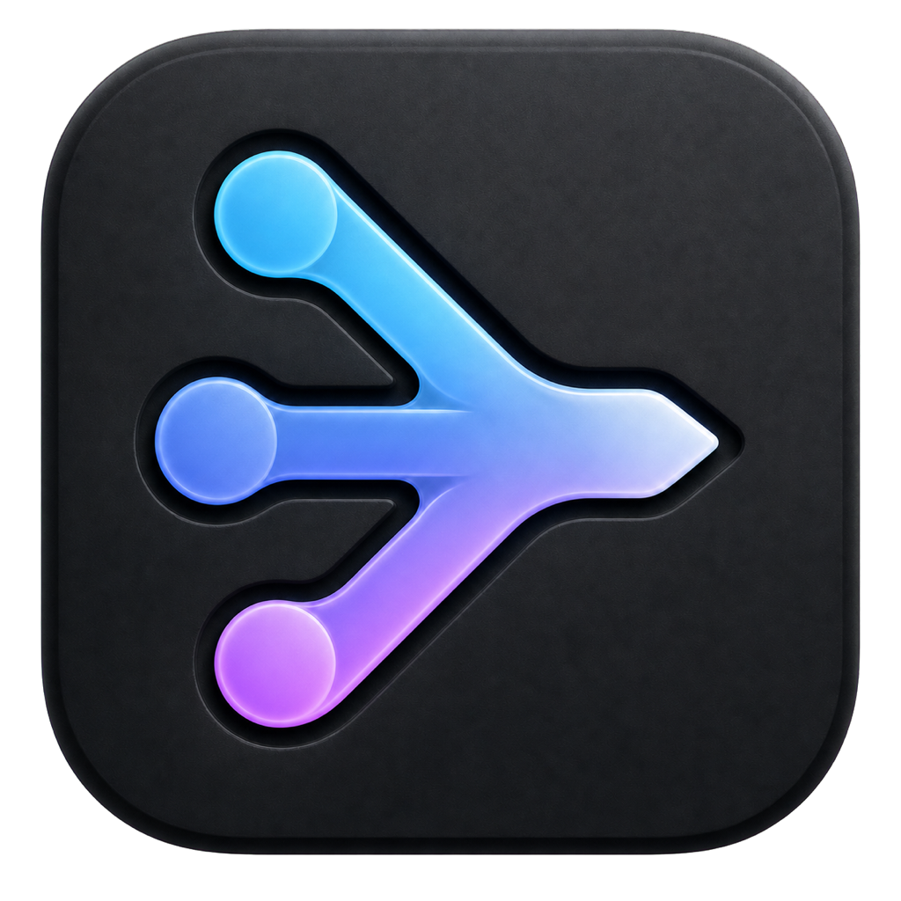
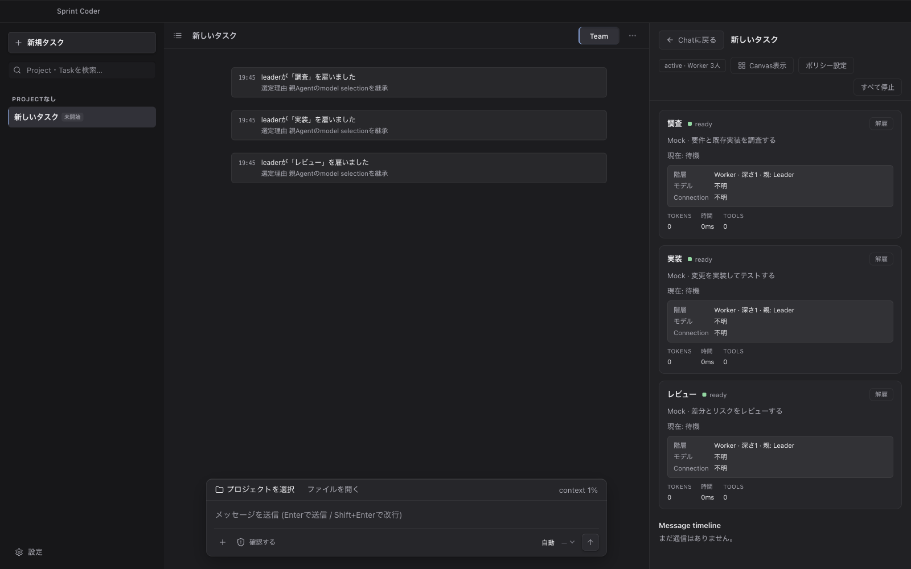
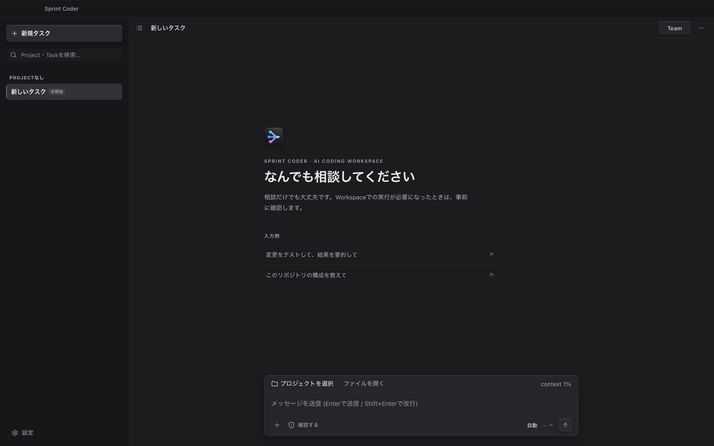

<div align="center">
  

# Sprint Coder

### AIを使うから、AIチームを動かすへ。

**Chat、コーディング、複数AIへの仕事の分担を、ひとつのTaskに。**<br />
Local-first desktop AI coding workspace for multi-agent software development.

[](https://github.com/Robbits-CO-LTD/sprint-coder/actions/workflows/ci.yml)
[](https://github.com/Robbits-CO-LTD/sprint-coder/releases)
[](https://github.com/Robbits-CO-LTD/sprint-coder/releases)
[](https://github.com/Robbits-CO-LTD/sprint-coder/stargazers)
[](LICENSE)

[公式サイト](https://sprintcoder.yuseilab.com/) · [ダウンロード](https://github.com/Robbits-CO-LTD/sprint-coder/releases) · [3分で起動](#3分で起動) · [セキュリティ](#local-firstとセキュリティ) · [FAQ](#よくある質問) · [設計資料](#設計資料)

</div>



## Sprint Coderとは

Sprint Coder（スプリントコーダー）は、**AIコーディングアシスタント、マルチエージェント実行、ローカルの開発環境**を一つにまとめる、local-firstなオープンソースのデスクトップアプリです。Codex CLI、Claude Code CLI、OpenAI、Anthropic、Google Gemini、xAI、OllamaなどからTaskごとにモデルを選び、必要になった瞬間だけ、同じ会話をLeaderと複数WorkerのAI Teamへ切り替えられます。

Sprint Coder is an open-source, local-first desktop AI coding workspace that brings Codex CLI, Claude Code, Gemini, cloud APIs, local LLMs, and multi-agent software development into one Task.

> [!WARNING]
> 現在はearly betaです。機能、データ形式、配布方法は今後変更される可能性があります。重要なリポジトリでは、差分と承認内容を確認しながら利用してください。

## なぜSprint Coderなのか

AIモデルが増えても、開発が自動的に速くなるわけではありません。人が複数のチャットを開き、前提を説明し直し、結果を集めて整合性を確認している限り、ボトルネックは人のままです。

Sprint Coderは、一人のAIとの対話を入口に、仕事が大きくなったときだけ役割を持つAI Teamへ展開します。Leaderが調査・実装・レビューなどをWorkerへ分担し、進行と成果を同じTaskへ戻します。

| 経営・組織の課題                   | Sprint Coderが変えること                               |
| ---------------------------------- | ------------------------------------------------------ |
| AI活用が個人のチャット技術に閉じる | Task、Team、実行履歴を共通の仕事単位にする             |
| 調査・実装・レビューが直列になる   | Leaderが複数Workerへ役割分担し、並列化する             |
| 特定ベンダーへの依存が強くなる     | CLI、公式API、OpenAI互換API、ローカルLLMを選べる       |
| AIが何を実行したか追いにくい       | ファイル差分、コマンド、承認、Workerの活動を画面に残す |
| 機密性と利便性の判断が曖昧になる   | Task単位のAccess設定とProvider選択で境界を明示する     |

## 一人で始め、Teamで加速する

1. **Chat** — 相談、設計、実装依頼を一人のAIから始める。
2. **Workspace** — ファイル編集、差分確認、コマンド実行を同じ画面で扱う。
3. **Team** — 仕事が大きくなったら、会話を維持したままLeaderとWorkerへ展開する。
4. **Control** — 進行、reasoning、context、承認待ち、Workerの成果を追跡する。
5. **Resume** — TaskとTeamの状態をローカルに保存し、再起動後も続きから再開する。



## 主な機能

- **ChatからTeamへ** — 1対1の会話を、同じTask・履歴のままLeaderと複数WorkerのTeamへ切り替えられます。
- **Multi-agent orchestration** — LeaderがWorkerの雇用、指示、停止、再開、成果統合を担当します。
- **Model / ProviderをTaskごとに選択** — 組み込みCLI、公式API、OpenAI互換API、ローカルLLMを一つのモデルピッカーから利用できます。
- **Local-firstな履歴** — Task、Message、Turn、Teamの状態を端末内へ保存します。
- **Managed workspace tools** — ファイル変更、差分、コマンド、承認履歴を画面で追跡します。
- **Access control** — `確認する` / `自動` / `フルアクセス`を入口に、実行範囲をTask単位で制御します。
- **Skill対応** — Sprint Coder内蔵SkillとSkill Creatorで作成したSkillをChatやTeamへ追加できます。Portable／Codex Native／Claude Nativeの互換性を確認し、未対応機能は黙って無視せず停止します。Codex実行では選択した管理コピーだけを隔離rootから渡し、隔離を確認できないCLIではTurnを開始しません。詳しくは[Skillガイド](docs/skills.md)を参照してください。

## 対応Runtime / Provider

| 種別          | 対応先                                                                                     |
| ------------- | ------------------------------------------------------------------------------------------ |
| 組み込みCLI   | Codex CLI、Claude Code CLI                                                                 |
| 公式API       | OpenAI、Anthropic、Google Gemini、xAI、OpenRouter                                          |
| OpenAI互換API | Mistral、DeepSeek、Groq、Moonshot AI、MiniMax、Zhipu AI、NVIDIA NIM、Cloudflare Workers AI |
| ローカルLLM   | Ollama、LM Studio、LocalAI                                                                 |
| 開発・評価    | Mock Runtime                                                                               |

組み込みCLIは端末にインストール済みのCLIと認証を使います。外部APIは「設定 → モデルと接続」から追加・検証します。利用可能なmodel / tool capabilityは接続先によって異なり、外部APIには各Providerの料金が発生する場合があります。

## 3分で起動

### 必要なもの

- macOS、Windows、またはLinux
- [Node.js 22](https://nodejs.org/) とnpm
- Git
- 実AIを使う場合は、認証済みのCodex CLI / Claude Code CLI、または対応ProviderのAPI key

### ソースから起動

```bash
git clone https://github.com/Robbits-CO-LTD/sprint-coder.git
cd sprint-coder
nvm use
npm ci
npm start
```

`nvm`を使わない場合は、`node --version`が`v22.x`であることを確認してください。Provider未設定でもMock Runtimeで基本操作を試せます。ビルド済みartifactが公開されている場合は[GitHub Releases](https://github.com/Robbits-CO-LTD/sprint-coder/releases)から取得できます。

### 最初のTask

1. 「新規タスク」を作成する。
2. 必要に応じてProject / Workspaceを選択する。
3. Model、Effort、Accessを選ぶ。
4. メッセージを送り、ファイル変更やコマンドを確認する。
5. 並列化したくなったら「Team」を開き、Leaderへ目的を伝える。

## Local-firstとセキュリティ

Local-firstは、Task履歴、設定、実行状態を端末内で管理するという意味です。クラウドProviderを選んだTurnでは、生成に必要なpromptやcontextが選択先へ送信されます。完全にオフラインで使う場合は、Mock RuntimeまたはローカルLLMを選択してください。

- API keyは送信後にRendererから消去し、Main processがElectron `safeStorage`で端末内へ保存します。
- Rendererはsandbox / context isolationを有効にし、Node.js APIを直接公開しません。
- Workspace操作とProviderへのegressは、Taskの権限設定と監査対象になります。
- Codex / Claude / APIのTool Useは共通Managed Harnessを通り、ファイル操作、command sandbox、承認、監査を同じ契約で扱います。
- OS sandbox probeに失敗した環境ではcommand toolを公開しません。

詳しい設計と確認項目は[Security Checklist](docs/SECURITY_CHECKLIST.md)を参照してください。

## 技術アーキテクチャ

```text
React Renderer
    │ typed IPC
Electron Main ── Task / Team / Permission / Audit
    │
Runtime Host ─── Codex CLI / Claude Code CLI / Provider APIs / Local LLM
    │
Managed Harness ─ File tools / Command sandbox / Approval
    │
Local Workspace + SQLite state
```

主な構成:

```text
apps/desktop/       Electron Main / Preload / React Renderer / Runtime Host
packages/contracts/ IPC・永続化・Provider間で共有するschemaと型
packages/domain/    権限、Tool、Turnなどのpure domain logic
tests/e2e/          packaged appを対象にしたPlaywright E2E
docs/               プロダクト、設計、セキュリティ、計画
tasks/              実装計画と設計レビュー記録
```

## 診断ログ

起動失敗、Main processの未処理エラー、RendererやElectron子processの異常終了は、promptやresponse本文を含まないJSON Linesログへ記録します。

| OS            | 保存先                             |
| ------------- | ---------------------------------- |
| macOS / Linux | `~/.sprintcoder/logs/`             |
| Windows       | `%USERPROFILE%\.sprintcoder\logs\` |

```text
.sprintcoder/logs/
├── system/system.jsonl
├── chat/<taskId>.jsonl
└── team/<teamId>.jsonl
```

各streamは5MBで1世代ローテーションします。prompt、response、Teamメッセージ本文、環境変数全体は診断ログへ保存しません。既知のcredential形式やsecret項目は保存前に秘匿化しますが、第三者へ共有する前には内容を確認してください。

## 開発

```bash
npm ci
npm start
```

| コマンド                      | 内容                                             |
| ----------------------------- | ------------------------------------------------ |
| `npm run typecheck`           | 全workspaceのTypeScriptを検査                    |
| `npm run lint`                | ESLintを実行                                     |
| `npm run format:check`        | Prettierによる形式チェック                       |
| `npm test`                    | Vitestのunit / integration testを実行            |
| `npm run e2e`                 | production packageを作成し、Playwright E2Eを実行 |
| `npm run test:provider-smoke` | opt-inの実Provider smoke testを実行              |

E2Eはpackage作成とnative module検証を含みます。通常の変更では対象test、typecheck、lintから先に実行してください。CIはmacOS、Windows、Linuxで検証します。

作業中のデスクトップにウィンドウを表示せず開発版E2Eを実行する場合は、非表示モードを明示します。

```bash
SPRINT_CODER_E2E_MODE=dev SPRINT_CODER_E2E_HIDDEN=1 npm run e2e -- --grep-invert 'macOS window lifecycle'
```

このモードでは描画とDOM操作を維持し、起動・再表示によるウィンドウ表示を抑止します。macOSではアプリのactivationも禁止します。既存の開発用ウィンドウには適用しません。実ウィンドウの再表示を確認する`macOS window lifecycle`は上記コマンドの対象外です。Computer Useによる実画面操作、OSのフォーカス挙動、可視ウィンドウの性能受入れは非表示E2Eでは証明できません。

<details>
<summary><strong>Windowsインストーラーをローカルで作る</strong></summary>

Node.js 22、Python 3、Visual Studio 2022 Build Tools（「C++によるデスクトップ開発」）、Inno Setup 6を用意し、PowerShellで実行します。

```powershell
npm ci
node node_modules/electron/install.js
powershell -ExecutionPolicy Bypass -File apps/desktop/scripts/ensure-inno-setup.ps1
npm run make:windows
```

ウィザード付きインストーラーは`apps/desktop/out/make/squirrel.windows/x64/Sprint-Coder-Installer.exe`、portable ZIPは`apps/desktop/out/make/zip/win32/x64/`へ出力されます。手元のbuildは未署名のため、Windowsから警告が表示される場合があります。正式配布の署名要件は[release workflow](.github/workflows/release-beta.yml)と[設計資料](docs/PRODUCT_AND_TECHNICAL_DESIGN.md)を確認してください。

</details>

## 配布状態

- stable / beta versionをSemVerで管理し、betaには`-beta.N`を付けます。
- beta workflowはmacOSのDMG / 更新用ZIPとUbuntu portable ZIPを作り、GitHub prereleaseをDraftとして用意します。
- Windows installer / portable ZIP / Squirrel更新artifactはローカルでコード署名し、同じDraft Releaseへ添付します。
- macOS beta artifactは現時点ではad-hoc署名で、Apple notarizationには未対応です。
- 公開済みの配布物は[GitHub Releases](https://github.com/Robbits-CO-LTD/sprint-coder/releases)で確認できます。

## 設計資料

- [プロダクト・詳細設計書](docs/PRODUCT_AND_TECHNICAL_DESIGN.md)
- [Team v2・Multi-Provider改訂計画](docs/plan/team-v2/README.md)
- [参照Agentアーキテクチャ分析](docs/REFERENCE_AGENT_ARCHITECTURE.md)
- [Security Checklist](docs/SECURITY_CHECKLIST.md)
- [アクセシビリティ監査](docs/A11Y_AUDIT.md)
- [実装計画](tasks/IMPLEMENTATION_PLAN.md)

## よくある質問

### Sprint Coderは何ができるアプリですか？

AIとのChat、ローカルWorkspaceのファイル編集とコマンド実行、差分・承認履歴の確認、複数AI Workerへの調査・実装・レビューの分担を、一つのTaskで扱えるAIコーディングデスクトップです。

### Codex CLIやClaude Codeとの違いは何ですか？

Codex CLIやClaude Codeを置き換えるものではありません。既存のCLI認証を利用しながら、クラウドAPIやローカルLLMも同じ画面から選択し、共通のManaged Harness、Access設定、Task履歴、AI Teamへ接続します。

### Google Geminiを使えますか？

はい。Google Gemini公式APIをProviderとして登録できます。OpenAI、Anthropic、xAI、OpenRouter、OpenAI互換API、Ollamaなどにも対応しています。利用可能なmodelとtool capabilityは接続先によって異なります。

### 無料で使えますか？

Sprint CoderのソースコードはMIT Licenseで公開されています。接続するクラウドProviderやモデルによっては、別途API利用料金が発生します。

### コードや会話はローカルに保存されますか？

Task履歴、設定、実行状態は端末内に保存します。ただし、クラウドProviderを選んだTurnでは、生成に必要なpromptやcontextが選択先へ送信されます。完全にオフラインで使う場合はローカルLLMを選択してください。

### どのOSで動作しますか？

macOS、Windows、Linuxを対象にしています。ソースからの起動手順は[3分で起動](#3分で起動)、現在公開中のビルド済み配布物は[GitHub Releases](https://github.com/Robbits-CO-LTD/sprint-coder/releases)で確認できます。

## Contributing

Issue、改善提案、Pull Requestを歓迎します。大きな変更は、先にIssueで目的と範囲を共有してください。

## License

[MIT License](LICENSE)

---

<div align="center">
  <strong>One Task. One Team. Ship with control.</strong><br />
  Sprint Coder — local-first multi-agent AI coding desktop app.<br />
  Developed, owned and managed by <a href="https://robbits.co.jp/">Robbits Inc.</a>
</div>
