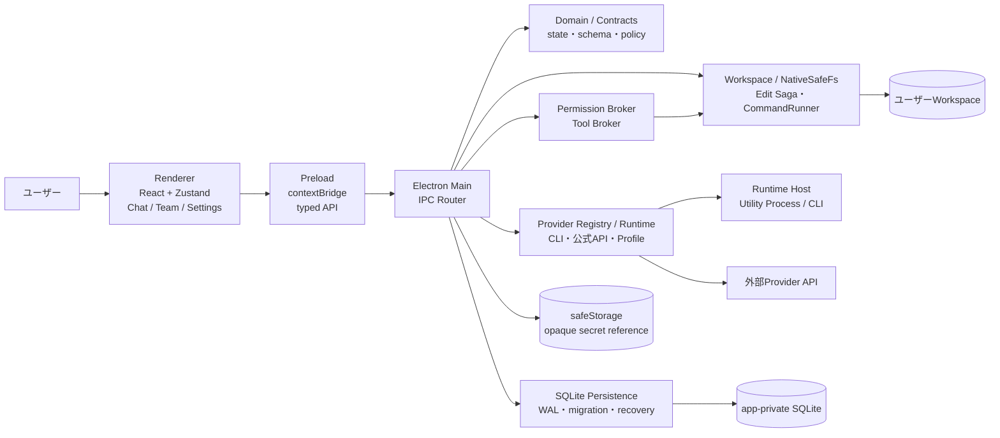
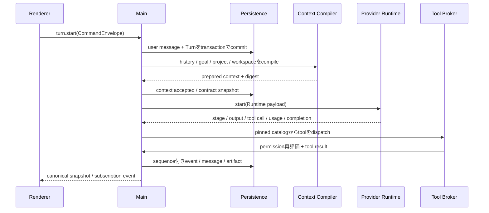
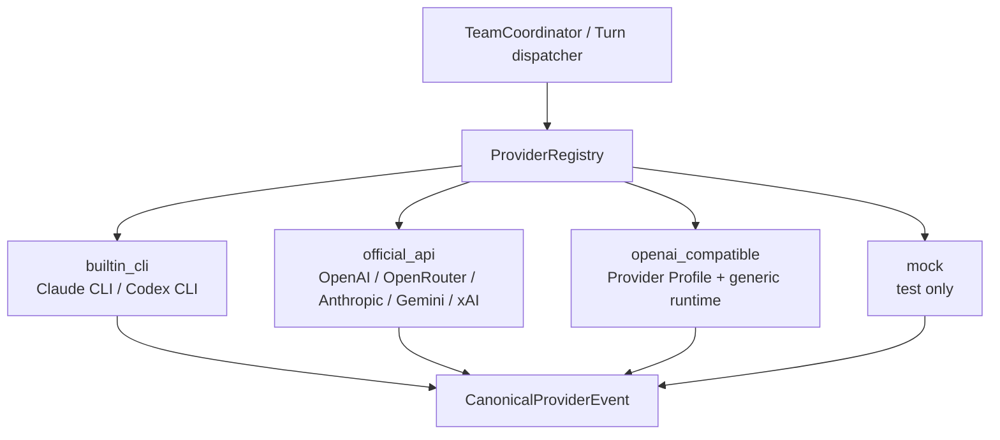

# Sprint Coder 設計概要

更新日: 2026-08-08
対象: `apps/desktop` と `packages/*` の現行実装
製品: Sprint Coder (`@sprint-coder/desktop`)

この文書は、Sprint Coderの設計を初めて読む人が「どこに何があり、どの境界を壊してはいけないか」を短時間で把握するための入口である。個別の要件、ADR、検証結果を置き換えるものではない。設計判断は[Team v2計画の最新ADR](plan/team-v2/adrs/README.md)、実装状況は[Current State](plan/team-v2/01-current-state.md)と現行コード／テストを優先し、その全体像をこの文書で補足する。

## 1. プロダクトの中心思想

Sprint Coderは、会話を起点にローカルのコード作業を進め、必要なときだけ同じ会話をTeamへ拡張するElectron製のAIコーディングアプリである。

設計原則は次のとおり。

- **Chat first**: 起動直後に設定を巡回せず、すぐ会話を開始できる。
- **Same surface**: 通常Chat、Team Leader、Workerが同じChatSurfaceを共有する。Teamへ移るときも会話の同一性を失わない。
- **Local first**: Task、会話、実行イベント、権限、Team状態、Project contextを端末内へ永続化し、再起動後に復元する。
- **Explicit trust**: Workspace、Shell、外部通信、秘密情報などの境界をUIと監査イベントへ明示する。
- **Observable execution**: 生成、tool call、承認待ち、実行、停止、完了をRun／Activityとして追跡できる。
- **Fail closed**: 検証できないConnection、古い権限、範囲外のpath、未確認のRuntime停止は、推測して進めず拒否または隔離する。
- **Calm motion**: Canvasの移動やRun表示のアニメーションは、状態変化の説明に限定する。`prefers-reduced-motion`では動きを抑制する。

## 2. 全体アーキテクチャ



### 2.1 各層の責務

| 層        | 主な責務                                                                       | してはいけないこと                                         |
| --------- | ------------------------------------------------------------------------------ | ---------------------------------------------------------- |
| Renderer  | 表示、入力、局所的なprojection、キーボード操作、Canvasのカメラ                 | DB、秘密情報、Provider SDK、任意Node APIへ直接アクセスする |
| Preload   | `contextBridge`で公開する最小API、入力・出力schema検証、IPC相関                | 任意のIPC channelや未検証payloadをRendererへ渡す           |
| Main      | IPCの認可、永続化、Runtime選択、権限、Workspace副作用、Team orchestration      | Rendererの表示状態を正本にする                             |
| Contracts | Zod schema、IPC channel、event、Providerのcanonical型                          | Provider固有の実行ロジックを持つ                           |
| Domain    | Turn／Team／権限／Toolの純粋な規則と状態遷移                                   | Electron、SQLite、Provider SDKへ依存する                   |
| Runtime   | CLIまたはAPIのstreamをcanonical eventへ変換し、cancel／usage／resolutionを返す | Team CoreへProvider名の条件分岐を漏らす                    |

RendererはMainから受け取った正規化済みのsnapshotを表示する。状態を変更する操作は、Preloadのtyped APIからMainへCommandとして渡し、Mainがtransactionやpolicy checkを終えた後にcanonicalな結果を返す。

## 3. リポジトリの構成

| パス                                   | 役割                                                                                                 |
| -------------------------------------- | ---------------------------------------------------------------------------------------------------- |
| `apps/desktop/src/renderer`            | React UI、ChatSurface、Project／Task、Goal、Team Canvas／List、Settings、Zustand store               |
| `apps/desktop/src/preload`             | `window.sprintCoder` API、IPC envelope、subscription buffer                                          |
| `apps/desktop/src/main`                | SQLite、IPC router、Runtime、Provider、Permission／Tool Broker、Team coordinator、Workspace mutation |
| `apps/desktop/src/runtime-host`        | CLI RuntimeとMain間のprotocol、Utility Process、Team MCP bridge                                      |
| `packages/contracts`                   | Renderer／Preload／Main／Runtimeで共有するZod schemaとTypeScript型                                   |
| `packages/domain`                      | Turn、Tool catalog、Permission policy、Teamの境界など、Electron非依存の規則                          |
| `docs/PRODUCT_AND_TECHNICAL_DESIGN.md` | Chat／UX／非競合部分の詳細設計 baseline                                                              |
| `docs/REFERENCE_AGENT_ARCHITECTURE.md` | Agent Kernel、Context Compiler、Tool Brokerの参照設計                                                |
| `docs/plan/team-v2`                    | Team v2、Provider、migration、security、testの現行ADRと実装計画                                      |
| `.github/workflows`                    | CI、Provider smoke、macOS／Linux中心のBeta release検証                                               |

## 4. ドメインモデル

### 4.1 Chat、Goal、Project context

Chatの正本は次の階層で表す。

```text
Task
└─ AgentThread（会話の長期的な主体）
   └─ Turn（1回のユーザー入力に対する実行）
      └─ Item（message / tool / approval / event / artifact）
```

- **Task**はタイトル、goal、draft、workspace、pin／archive、会話履歴の単位である。
- **Goal**はTaskに紐づく持続的な目的で、`active` / `paused` / `completed` / `blocked`を持つ。開始・pause・resume・clearはMainで永続化し、token使用量と時間を追跡する。Goal本文はContext Compilerが`goal` sourceのuser context fragmentとしてTurnへ渡す。
- **Project**は複数Taskから共有できる作業単位である。instruction、references、memories、folderとeffective workspace rootsを持ち、Turn開始時にcontext manifest／sealを作成する。参照元・digest・provenanceを保持し、外部文字列をシステム命令として扱わない。
- **Turn**の表示状態とRuntimeのstageは分離する。UIはMainから届くsnapshot／eventをprojectionし、RendererだけでTurnを完了扱いにしない。

### 4.2 Team

TeamはTaskを失わずに拡張したexecution domainである。

- Leader、Manager、Workerは永続的なAgent identityを持つ。
- 親Agent、depth、Manager Policyで再委譲範囲を決める。現在の上限はdepth 4で、Managerは直下Agentのhire／assignだけを行える。
- `TeamExecution`、`TeamAttempt`、`TeamActivity`、message／deliveryを分けて保存する。assign時点でexecution IDを発行し、queue、running、steer、cancel、restartを同じIDで追跡する。
- Team全体のAI実行は最大8件。Connectionごとのadmission、FIFO／round-robin／agingを組み合わせ、rate-limit時もattempt identityを維持する。
- CanvasとListはAgent／Execution／Activityのprojectionであり、orchestrationの正本ではない。

## 5. Turnの実行ライフサイクル



### 5.1 不変条件

1. User messageとTurn accepted eventのcommitが終わる前にRuntimeへ送信しない。
2. Turn開始時のcontext、tool catalog、permission epoch、workspace revisionをdigestとともに固定する。
3. Tool callはTurnにbindされたcatalogのID・version・schema・implementationだけを使う。同じ`callId`の二重実行を許可しない。
4. Rendererが受け取るeventはMainでschema検証し、Task／Turn／sequenceの範囲を確認してから公開する。
5. reasoning本文はtransientなpush channelで扱い、未整理の推測を`turn_events`やログへ永続化しない。通常の回答・tool・approval・file changeは再表示可能なeventとして保存する。

### 5.2 Turnの主な状態

| 状態                                | 意味                                                          |
| ----------------------------------- | ------------------------------------------------------------- |
| `queued`                            | 作業を受け付け、Runtime枠またはProvider枠を待っている         |
| `understanding` / `planning`        | Runtimeが依頼と方針を整理している                             |
| `executing`                         | Tool、Workspace、Provider処理を実行している                   |
| `synthesizing`                      | tool結果を回答へまとめている                                  |
| `waiting_approval`                  | ユーザー操作が必要で、実行中とは区別して停止している          |
| `canceling`                         | 協調停止を要求済みで、停止receiptを待っている                 |
| `completed` / `failed` / `canceled` | 終端状態                                                      |
| `interrupted`                       | アプリ終了・Runtime異常などで、再起動時に確定された未完了状態 |

## 6. ProviderとRuntime



- `ProviderConnection`は実行設定の単位で、provider ID、runtime kind、表示名、verification、rate limit、opaque secret referenceを持つ。
- Provider、Connection、Runtime、Modelを混同しない。Pickerが保存するのはrequested provider／model、Runtimeが観測した値はresolved provider／modelとして別に保存する。返されない値は推測せず`unknown`にする。
- Provider Runtimeの外側へはraw SDK eventを返さず、output、tool call、usage、resolution、rate-limit、completion、normalized errorからなるcanonical eventだけを返す。
- Team CoreはProvider AdapterやSDKをimportしない。Provider固有差分は`ProviderRuntime`の登録、公式Adapter、または宣言的`ProviderProfile`へ閉じ込める。
- built-in CLIはConnection rate admissionを使わず、Team全体の8枠だけを消費する。公式API／compatible profileはConnectionの同時実行上限と二段階Schedulerを通る。
- verificationの既定TTLは24時間、preflightは3秒である。期限切れや検証不能を資格情報の失敗へ誤分類せず、再確認待ちとして扱う。

## 7. 権限、Tool、Workspace

### 7.1 Permission BrokerとTool Broker

1. Runtimeが要求するtoolは、Turn開始時に作成したcatalog snapshotへbindする。
2. Tool Brokerは入力をclone／freezeし、schema、catalog version、policy epoch、Turn identityを確認する。
3. Permission Brokerはcapability（workspace read/write、shell、network、external open、secret useなど）とresource scopeを評価する。
4. 承認が必要な場合はApproval Cardへ理由、対象、影響範囲、正規化後のcommand／pathを表示する。
5. 実行直前にpolicy epoch、path guard、workspace revisionを再検証する。途中で権限が変わった場合は実行しない。

Access presetは`ask`、`auto`、`full`であり、`full`を既定にしない。拒否は単なるRendererの表示ではなく、Mainの永続auditとRuntimeへの結果通知になる。

### 7.2 Workspaceと変更の安全境界

- Workspaceは選択したrootとeffective workspace rootsの集合として扱い、相対pathをrootへ解決した後にpath guardを発行する。
- Shellはcommandをsegment単位で解析し、実行ファイル、引数、cwdを表示内容と一致させる。Process treeの停止、stdout／stderrの順序付き保存、ANSI escapeの無害化を行う。
- 読み書き可能なWorkerは原則として専用worktreeまたはTeam execution isolationへ束縛する。共有rootへ勝手に書き込まない。
- ファイル変更はNativeSafeFsとEdit Sagaを通す。journal-first、owner／hash／size、revision／fence、逆順compensation、crash-unknown quarantineを使い、Mainが証明できない変更を完了扱いにしない。
- Rendererの手編集はfile digestを返し、Mainは保存直前に対象ファイルが変わっていないことを確認する。HEADを無条件に上書きしない。

### 7.3 Secretとログ

- Secret操作はMainのsafeStorage wrapperだけが行う。SQLiteにはopaque referenceとmask済みmetadataのみ保存する。
- Renderer、Runtime payload、audit、diagnostic、crash report、ログへ完全なAPI key、Authorization header、暗号化payload、会話全文を流さない。
- secure loggerは呼び出し側のmaskを信用せず、header、URL query、body、Errorをsink前にredactする。

## 8. 永続化、migration、再起動復元

### 8.1 SQLite

`SqlitePersistenceClient`がMain-ownedのSQLiteを開き、WAL、foreign key、busy timeoutを設定する。schema migrationはversionとchecksumを持つtransactionで適用し、適用前backup、`foreign_key_check`、legacy lineageの互換判定を行う。現在のmigration sourceはv64まで存在する。

主な永続化領域は以下である。

- Task、message、Turn、sequence付き`turn_events`、input queue、idempotent operation
- context fragment、context seal、Project instruction／reference／memory／folder
- permission policy、grant、approval、audit、policy epoch outbox
- command run、output chunk、file change、generated image
- Edit Saga、mutation lease／fence、native mutation intent、quarantine、evidence／assurance
- Team、Agent、membership、message／delivery、execution／attempt／activity、mission、worktree／isolation、Canvas view
- Provider Connection、verification、catalog／selection、usage、routing、secret reference
- Goal lifecycle（status、token／time usage、started／updated timestamp）

### 8.2 起動時の復元

- DBを開く前に`quick_check`を実行する。壊れたDBは隔離し、利用可能な`.pre-migration.bak`を検査して復元する。backupも壊れている場合だけfresh startへ進む。
- 起動時にactiveなTurn／executionを検出し、実際に再開できないものは`interrupted`またはpausedとして確定する。未確定の実行をUI上だけで成功にしない。
- legacy migrationは削除より互換読み取りを優先し、旧built-in identity、旧Project／memory／Team lineageを現行の正本へ束ねる。checksum mismatchを隠すために検証を弱めない。

### 8.3 CancelとRuntime隔離

停止は次の順で行う。

1. MainがTurnを`canceling`へ永続化し、Runtimeへ協調cancelを送る。
2. Runtimeからstop receiptを待つ。現在のRuntime Hostはbounded timeout（5秒）で確認する。
3. receiptが得られない場合はHostを再起動／隔離し、古いruntime instance・operationの遅延eventを無視する。
4. 旧Turnが停止未確認のまま新しい実行を開始しない。Stop & Sendも旧operationを再利用せず、新しいoperationとして記録する。
5. 停止確定後にのみTurnを`canceled`へ遷移し、queueやTeam executionを次へ進める。

この順序により、停止したはずの古いRuntimeが新しいTurnへ出力やtool callを混入させることを防ぐ。

## 9. UI設計

### 9.1 ChatSurface

通常ChatとCanvas上のLeader／Workerは同じChatSurfaceを使う。SurfaceHeader、Timeline、ContextBar、Composer、SurfaceFooterを共通component contractとして持ち、containerとviewportだけを変える。

- SidebarはTask／Projectの探索、Mainは会話と実行の読書領域に責務を分ける。
- Runは空の吹き出しではなくGeneration Canvasとしてstage、elapsed、停止、承認待ちを表示し、完了後はcompact履歴へ畳む。
- Markdown、code、table、quote、file change、command、Approval、Team activityを同じTimelineで追跡する。
- Model PickerはMain-owned catalog query、paging、検索、filter、virtualizationを使い、表示用の選択とcanonical Task／Agent selectionを分ける。
- Project picker／searchは、入力、該当なし、新規Project、Projectなしで作業、keyboard focusの状態を明確にする。

### 9.2 Team Canvas／List

- CanvasはAgent／Executionのprojectionで、pan、zoom、selection、fit、focus、camera ownershipを持つ。viewportとnode位置はTask単位で永続化する。
- zoom out時はLODで本文を省略し、役割、model、Connection、status、進捗、待機理由を残す。List ViewはCanvasの完全なfallbackである。
- Teamへの昇格は別画面への破棄ではなく、ChatSurfaceをLeader nodeへshared-element移動する。Workerの生成、通信ケーブル、Activity Cardは状態を説明するために使う。
- Worker間のmessage、steer、cancel、reportはidentity・scope・statusをMainで検証し、Canvasの見た目だけでは許可しない。

### 9.3 アクセシビリティとビジュアル

- keyboardだけでTask、Composer、Picker、Approval、Team Canvas／Listを操作できることを基準にする。
- 色だけに頼らず、label、icon、state text、対象path／domainを併記する。Team execution labelはWCAG AAを満たす。
- UI chromeの装飾iconは`apps/desktop/src/renderer/components/icons.tsx`のcurrentColor inline SVGを使い、emoji／Unicode記号を状態表現の正本にしない。アイコンは装飾時`aria-hidden`、icon-only操作時はaccessible nameを持つ。

## 10. 検証とリリース

### 10.1 検証の梯子

1. 変更箇所のtypecheck／lintと対象unit test
2. 影響するpackage／subsystemのtest
3. Runtime、SQLite、native、packagedなど変更境界のintegration／E2E
4. release gateでfull suite、各OSのpackage smoke、必要なProvider実API smoke、Computer Useを実行

未実行のcheckをgreenとして記録しない。実API smokeは明示flagと保護されたsecret環境でだけ行い、evidenceにはsecretや会話全文を含めない。

### 10.2 リリース方針

- macOS／LinuxのBeta release artifactと更新manifestはGitHub Actionsで検証・作成する。
- **WindowsのリリースbuildはGitHub Actionsで実行しない。** 証明書を付与できるWindows環境でbuild・署名し、署名済みartifactを別途releaseへ登録する。CIにWindows互換テストが残っていても、それは署名済みリリースartifactの代替ではない。
- Windows signingに必要な証明書や秘密鍵をmacOS／Linux runnerへコピーしない。
- release前にはversion、embedded client version、native module／NativeSafeFsのElectron ABI、署名、artifact名、checksum、update manifestを確認する。

## 11. 変更時に参照する文書

- [Product and Technical Design](PRODUCT_AND_TECHNICAL_DESIGN.md): Chat、UX、Run、Canvasの詳細設計
- [Reference Agent Architecture](REFERENCE_AGENT_ARCHITECTURE.md): Agent Kernel、Context Compiler、Edit Saga、Assuranceの参照設計
- [Team v2 README](plan/team-v2/README.md): 現行計画、文書優先順位、Milestone
- [Team v2 Current State](plan/team-v2/01-current-state.md): 実装状況と未実行gate
- [Provider Architecture](plan/team-v2/03-provider-architecture.md): Provider／Connection／Runtime境界
- [Security and Secrets](plan/team-v2/09-security-and-secrets.md): Secret Storage、verification、redaction
- [Testing and CI](plan/team-v2/10-testing-and-ci.md): test ladder、architecture test、release smoke
- [Acceptance Gates](plan/team-v2/12-acceptance-gates.md): Core GA、Multi-Provider GA、Compatibility Packの完了条件
- [A11Y Audit](A11Y_AUDIT.md): accessibilityの検証方針と証拠
- [Security Checklist](SECURITY_CHECKLIST.md): 実装時のセキュリティ確認項目

## 12. 設計を変更するときのチェックリスト

- Rendererに新しい副作用を追加していないか。Main／Preloadのtyped boundaryを通っているか。
- 新しい状態やeventに、contract schema、永続化、migration、restart復元、projection testがあるか。
- Provider固有コードをTeam Coreへimportしていないか。requested／resolved identityを混同していないか。
- Tool、permission、path guard、policy epoch、workspace revisionを実行直前にも確認しているか。
- cancel／failure／late event／duplicate operationを正常系と同じ粒度で扱っているか。
- secret、Authorization、prompt全文、ユーザーWorkspaceの不要な内容がログ・fixture・診断へ出ていないか。
- Canvasを正本にしていないか。List／keyboard／reduced-motionのfallbackが残っているか。
- migration checksum、backup、legacy互換を壊していないか。
- release対象がWindowsの場合、Windows環境で署名buildを行う手順になっているか。
